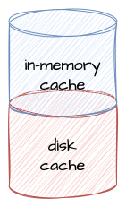
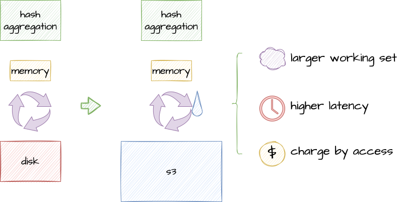
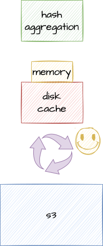

# Overview

## What is foyer?

***foyer***, just as its slogan, is a hybrid cache library for the Rust programming language. 🦀

## What is hybrid cache?

A hybrid cache is a caching system that utilizes both memory and disk storage simultaneously.

  
  

It is commonly used to extend the insufficient memory cache for the system uses Object Store Service (OSS, e.g. AWS S3) as its primary data storage[^oss-dia] to **improve performance** and **reduce costs**[^risingwave].

## Why we need a hybrid cache?

More and more systems are using OSS as their primary data storage. OSS has many great features, such as low storage cost, high availability and durability, and almost unlimited scalability.

However, there are also downsides with OSS. For example, the latency is high and uncontrollable, and its price increases with each accesses. The downsides will be further amplified in a large working set because of more data exchange between cache and OSS.

  
  

With a hybrid cache, the ability to cache the working set can be extended from memory only to memory and disk. This can reduce data exchange between cache and OSS, thereby improving performance and reducing costs.

  

## Highlights of foyer

As a hybrid cache, ***foyer*** provides the following highlighted features:

- **Hybrid Cache**: Seamlessly integrates both in-memory and disk cache for optimal performance and flexibility.
- **Plug-and-Play Algorithms**: Empowers users with easily replaceable caching algorithms, ensuring adaptability to diverse use cases.
- **Fearless Concurrency**: Built to handle high concurrency with robust thread-safe mechanisms, guaranteeing reliable performance under heavy loads.
- **Zero-Copy Abstraction**: Leveraging Rust's robust type system, the in-memory cache in foyer achieves a better performance with zero-copy abstraction.
- **User-Friendly Interface**: Offers a simple and intuitive API, making cache integration effortless and accessible for developers of all levels.
- **Out-of-the-Box Observability**: Integrate popular observation systems such as Prometheus, Grafana, Opentelemetry, and Jaeger in just **ONE** line.

## Why use foyer, when you have 'X'?

Unfortunately, there is currently no general proposed hybrid cache library in the Rust community. If you have a need for hybrid cache, ***foyer*** would be your best choice.

CacheLib[^cachelib] provides a Rust binding. However, it only provides limited interfaces. You still need to patch the C++ codebase if you have requirements such as logging, metrics, or tracing supports. Besides, ***foyer*** provides a better optimized storage engine implement over CacheLib. You can try both ***foyer*** and CacheLib to compare the benchmarks.

For the needs as an in-memory only cache, ***foyer*** also provides compatible interfaces and competitive performance. Benchmarks[^benchmark] show that ***foyer*** outperforms moka[^moka] and is only second to quick-cache[^quick-cache].

  

## What's next?

- Learn how to use ***foyer*** in your project, goto [Getting Started](/docs/category/getting-started).
- Learn how to solve various challenging situations with ***foyer***, goto [Topic](/docs/category/topic).
- Learn how other projects use ***foyer***, goto [Case Study](/docs/category/case-study).
- Learn the design of ***foyer***, goto [Design](/docs/category/design).

## Acknowledgement

***foyer*** draws inspiration from CacheLib[^cachelib], a well-known cache library written in C++, and Caffeine[^caffeine], a widely-used in-memory cache library in Java, among other projects like moka[^moka], intrusive-rs[^intrusive-rs], etc.

Thank you for your efforts! 🥰

[^oss-dia]: Systems using OSS as its primary data storage: [RisingWave](https://github.com/risingwavelabs/risingwave), [Chroma Cloud](https://github.com/chroma-core/chroma), [SlateDB](https://github.com/slatedb/slatedb), etc.

[^risingwave]: How streaming database RisingWave use foyer to improve performance and reduce costs: [Case Study - RisingWave](/docs/case-study/risingwave).

[^cachelib]: [FaceBook/CacheLib](https://github.com/facebook/cachelib).

[^benchmark]: Benchmark with mokabench[^mokabench]: [PR comments](https://github.com/moka-rs/mokabench/pull/20#issuecomment-2080429290).

[^moka]: [moka-rs/moka](https://github.com/moka-rs/moka).

[^quick-cache]: [arthurprs/quick-cache](https://github.com/arthurprs/quick-cache).

[^caffeine]: [ben-manes/caffeine](https://github.com/ben-manes/caffeine).

[^intrusive-rs]: [Amanieu/intrusive-rs](https://github.com/Amanieu/intrusive-rs).

[^mokabench]: [moka-rs/mokabench](https://github.com/moka-rs/mokabench).