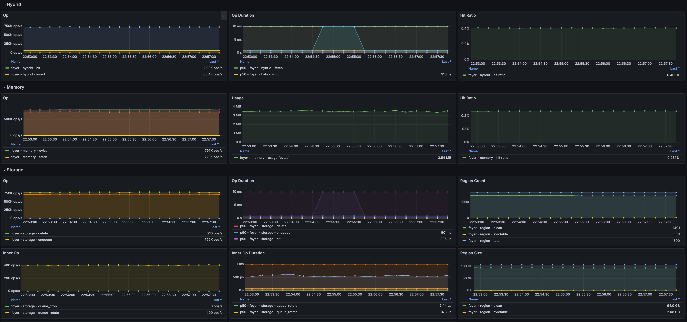

# Setup Monitor System

This article will guide you through the process of setting up the monitor system for ***foyer***.

***foyer*** provides observability for monitoring in 3 aspects:
- **logging**: Provides logging in trace/debug/info/warn/error levels with [tracing](https://crates.io/crates/tracing) ecosystem.
- **metrics**: Provides operation counters, operation duration histograms, information gauges with [metrics](https://crates.io/crates/metrics) ecosystem.
- **tracing**: Provide tail-based tracing for slow operation diagnosis with [fastrace](https://crates.io/crates/fastrace).

For each ecosystem, there are rich surrounding libraries available. The article will only introduce the example of the most basic configuration. For more details, please refer to the document of each ecosystem.

## 1. Setup logging monitoring

***foyer*** uses [tracing](https://crates.io/crates/tracing) ecosystem for logging monitoring. You can configure the filters and subscribers to control the format, content, and the target for logging.

Here is an example to setup logging monitoring to the console, decorate each log entry with line number, and filter the logs with `RUST_LOG` syntax.

Add the tracing-subscriber dependencies.

```toml
tracing-subscriber = { version = "0.3", features = ["env-filter"] }
```

Add the following lines at the start of your project.

```rust
tracing_subscriber::registry()
    .with(tracing_subscriber::fmt::layer().with_line_number(true))
    .with(EnvFilter::from_default_env())
    .init();
```

Then everything is set now! Now, you can run your project directly, or with a customized `RUST_LOG` arguments:

```bash
RUST_LOG=foyer_storage::large::generic=trace,info ./your-project-with-foyer
```

Here is a sample of the outputs:

```plain
2024-10-27T08:50:08.631742Z  INFO foyer_bench: 414: [foyer bench]: jemalloc is enabled.
2024-10-27T08:50:08.632902Z  WARN foyer_storage::store: 482: [store builder]: Setting up small object disk cache options, but only large object disk cache is enabled.
2024-10-27T08:50:08.639524Z  INFO foyer_storage::large::recover: 162: Recovers 0 regions with data, 1600 clean regions, 0 total entries with max sequence as 0, initial reclaim permits is 0.
2024-10-27T08:50:08.659042Z TRACE foyer_storage::large::generic: 344: EntryAddress {
    region: 1,
    offset: 8192,
    len: 1420,
    sequence: 19,
}
2024-10-27T08:50:08.660765Z TRACE foyer_storage::large::generic: 344: EntryAddress {
    region: 0,
    offset: 28672,
    len: 638,
    sequence: 41,
}
```

For more details, please refer to the [document](https://docs.rs/tracing/0.1.40/tracing/) of `tracing`.

## 2. Setup metrics monitoring

***foyer*** uses [metrics](https://crates.io/crates/metrics) ecosystem for metrics monitoring. [metrics](https://crates.io/crates/metrics) works like an adapter, ***foyer*** uses `metrics` to define what metrics to collect, and you can use the libraries from the metrics ecosystem to define how and where to collect them. (e.g. Prometheus, StatsD, NewRelic, etc.) Please refer to the [README](https://github.com/metrics-rs/metrics) and [document](https://github.com/metrics-rs/metrics) 

This section will take integrating with *Prometheus* as an example.

To integrate *Prometheus*，the trivial method is using the `metrics-exporter-prometheus` offered by `metrics`.

First, add the dependency to your project:

```toml
metrics-exporter-prometheus = "0.15"
```

Then setup the prometheus exporter.

```rust
let addr: SocketAddr = "0.0.0.0:19970".parse().unwrap();
PrometheusBuilder::new()
    .with_http_listener(addr)
    .set_buckets(&[0.000_001, 0.000_01, 0.000_1, 0.001, 0.01, 0.1, 1.0])
    .unwrap()
    .install()
    .unwrap();
```

However, some project may have already using lib [`prometheus`](https://crates.io/crates/prometheus) to export data. In this case, it is recommended to use [`metrics-prometheus`](https://crates.io/crates/metrics-prometheus) as an adapter between lib `metrics` and `prometheus`.

First, add `metrics-prometheus` as an dependency to your project:

```toml
metrics-prometheus = "0.7"
```

Then set the registry your project is using with `prometheus` as the target of `metrics` that ***foyer*** uses with `metrics-prometheus`.

```rust
// For example, `GLOBAL_METRICS_REGISTRY` is the registry your project is using with lib `prometheus`.

metrics_prometheus::Recorder::builder()
    .with_registry(GLOBAL_METRICS_REGISTRY.clone())
    .build_and_install();
```

Then export the registry like your project does before.

After collecting data with *Prometheus*, you can setup *Grafana* to display the metrics.

Here is an example of some exported metrics.

<div style="text-align: center;">

  
  
</div>

## 3. Setup tracing monitoring

***TBC ... ...***