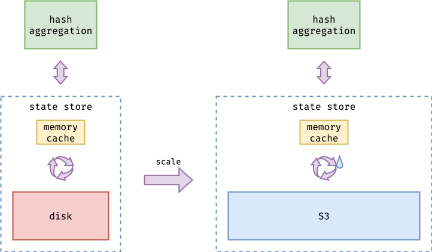
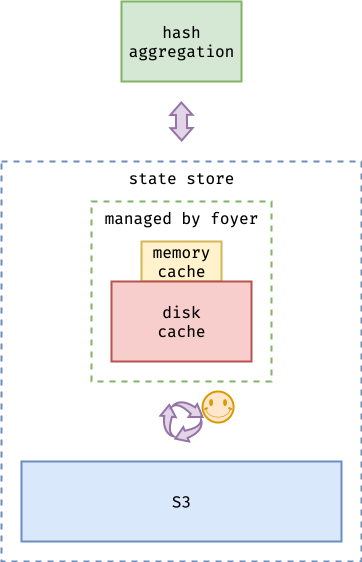
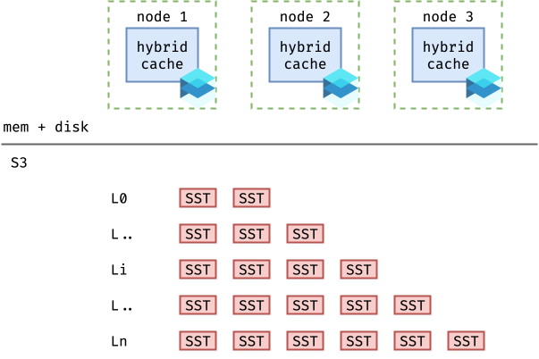
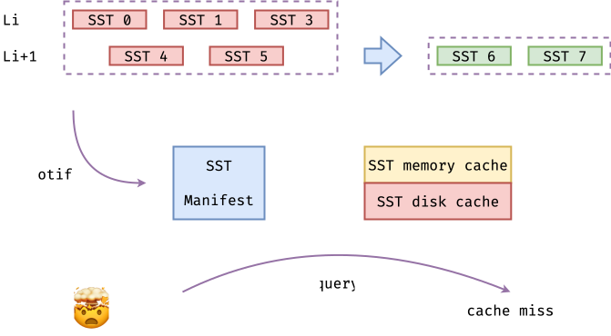
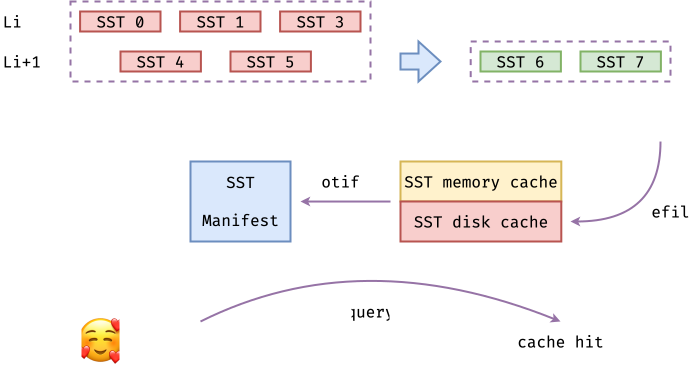
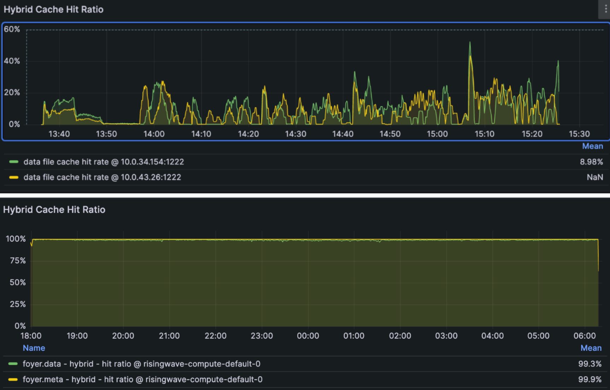

# RisingWave

[RisingWave](https://github.com/risingwavelabs/risingwave) is a real-time event streaming platform based on S3. This blog will introduce how RisingWave uses foyer to improve performance and reduce costs.

## Background

RisingWave's storage engine, Hummock, is a distributed LSM-Tree storage engine based on S3. Just like most data infrastructure that uses S3 for storage, RisingWave has the following advantages and disadvantages when using S3 as storage:

- **Pros:**
    1. *Simplified design:* Using S3 as shared storage and the source of truth can greatly simplify the design of distributed storage systems, eliminating the need to spend significant effort on obscure consistency protocols and complex fault tolerance.
    2. *High availability:* Fully leverage S3's high availability and durability to ensure service SLA.
    3. *Strong scalability:* S3's scalability is virtually unlimited. Storage can be easily scaled out at any time as the service grows.
    4. *Lower storage costs:* Compared with other storage services, S3 has lower storage costs. The larger the amount of data, the greater the cost advantage.
- **Cons:**
    1. *High latency:* S3’s latency is several orders of magnitude higher compared to other storage services (such as local NVME drives, EBS, etc.). Without optimization, this will lead to overall system performance degradation.
    2. *High access cost:* S3 charges based on the number of accesses. Without optimization, frequent S3 access will negate the storage cost advantage, or even make it worse.

Based on the above issue, RisingWave initially introduced a pure memory `ShardedLruCache`, adapted from RocksDB, to cache SSTable blocks of the S3-based LSM-tree. However, simply introducing an in-memory cache is not enough. In production environments, RisingWave still faces the following issues.

## Challenges and Solutions with ***foyer***

### 1. The memory cache cannot cover the working set

RisingWave, as an S3-based streaming system, is often used to handle large-scale streaming computation tasks. Compared to disk-based streaming systems, its tasks often have a larger working set. 

For example, RisingWave is often used to handle streaming join tasks where the state ranges from tens of gigabytes to several terabytes. The state of the hash aggregation operator far exceeds the capacity of the memory cache. Data needs to be frequently swapped in and out between the memory cache and S3.

However, due to the high latency of S3 and its charge-by-access pricing model. This can result in severe performance degradation and increased costs. Also, because memory resources are more expensive and limited, it is often difficult to the scale as large as disk.

After introducing ***foyer***, ***foyer*** can use both memory and disk as cache and automatically manage them. If you need more advanced features, such as automatic cache refill on miss or request deduplication, only very minor modifications are required.

After introducing foyer as a hybrid cache, when the operator's state is relatively large, the total of memory cache and disk cache can fully accommodate the state, or accommodate much more state than pure memory alone. This reduces the amount of data that needs to be swapped in and out with S3, improves system performance, and lowers data access costs. This makes the solution comparable to a pure disk-based state store approach.

### 2. The cache invalidation caused by LSM-tree compaction

RisingWave's storage engine uses an S3-based LSM-tree as main data structure. Its structure can be simplified as shown in the diagram.

:::tip
The diagram is simplified; in reality, RisingWave uses the block of an SSTable as the smallest unit of retrieval, not the SSTable itself.
:::

LSM-tree needs compaction to optimize the index structure, reclaim expired data, and reduce space amplification and read amplification. LSM-tree compaction selects a group of SSTables, merges them, and generates a new group of SSTables. Compaction is executed asynchronously. When the compaction task is completed, the cluster’s meta node notifies other nodes, which asynchronously update the SSTable manifest. Therefore, compaction can cause entries in the cache that use the old SSTable to become invalid, resulting in cache misses during subsequent access and generating additional S3 accesses.

To avoid cache misses caused by LSM-tree compaction, RisingWave introduces compaction-aware cache refill. After compaction is completed and the compute node is notified to update the manifest, the compute node first refills the new SSTables into the cache, and then updates the local manifest. In this way, the new SSTables are already in the cache during the next access, preventing cache misses on the critical path. Therefore, system performance is improved.

In addition, to avoid the impact of refilled data on the hot cache, cache refill will directly place the data into the disk cache instead of the memory cache. In this way, hot cache jitter is minimized.

Moreover, as mentioned in the tips above, RisingWave actually fetches S3 in blocks rather than SSTables. During normal reads, only a single block is fetched, while a refill can fetch dozens to thousands of consecutive blocks in one request, reducing S3 access, improving system performance, and lowering costs.

<figcaption>A comparison of enabling/disabling cache refill under a certain load.</figcaption>

### 3. Trade-off between block size, S3 access and fragmentation

As a stream processing system, RisingWave often gets its upstream data from the CDC of OLTP systems, and its access tend to favor random reads rather than large-scale sequential reads. Also, since S3 has relatively high access latency and charges based on the number of accesses, selecting an appropriate minimum unit for fetching S3 data—that is, the block size—is very important for RisingWave.

***TBC ... ...***
