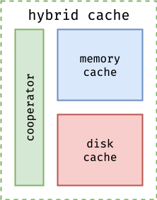

# Architecture

This blog introduces the architecture design of ***foyer*** from a top-down perspective.

## 1. Hybrid Cache

***foyer*** is a hybrid caching system that combines in-memory cache and disk cache. It automatically manages the behavior and lifecycle of cache entries between the in-memory cache and the disk cache.

Obviously, ***foyer*** consists of three components to provide hybrid cache functionality.

1. **Memory Cache (provided by crate `foyer-memory`):** Pure in-memory cache library. Similar to other in-memory cache libraries, it provides functionalities such as adding, deleting, updating, and querying cache entries. Besides, to be compatible with the disk cache, it also provides optimizations such as request merging and support for asynchronous interfaces. (This crate can be used separately as a pure in-memory cache with minimal overhead.)
2. **Disk Cache (provided by crate `foyer-storage`):** Includes the disk cache engines, IO engines, and device driver layer. It cannot be used independently and can only be utilized through ***foyer***.
3. **Cooperator (Integrated in crate `foyer`):** A lightweight wrapper to coordinate in-memory cache and disk cache.

Besides the hybrid cache mode, ***foyer*** can also operate as a pure in-memory cache in compatibility mode. This mode doesn't require any API modifications based on the hybrid cache and is therefore suitable for systems that need both pure in-memory cache and hybrid cache operation. In this mode, ***foyer*** provisions a no-op disk cache engine. This introduces only a minimal overhead in exchange for API compatibility.

If you only need to use ***foyer*** as a pure in-memory cache, you can directly use `Cache` instead of `HybridCache`. `Cache` is a re-export from the `foyer-memory` crate. It provides APIs and usage similar to mainstream cache libraries, and also offers all the features of the in-memory cache part within the ***foyer*** hybrid cache, including: interchangeable cache algorithms, request deduplication optimization, etc.

## 2. Memory Cache

***foyer***'s memory cache provides a high-performance, flexible, and composable pure in-memory cache implementation with the following key features:

- **Plug-and-Play Algorithms**: Empowers users with easily replaceable caching algorithms, ensuring adaptability to diverse use cases.
- **Fearless Concurrency**: Built to handle high concurrency with robust thread-safe mechanisms, guaranteeing reliable performance under heavy loads.
- **Zero-Copy In-Memory Cache Abstraction**: Leveraging Rust's robust type system, the in-memory cache in foyer achieves a better performance with zero-copy abstraction.

***foyer***'s in-memory cache consists of three main components:

1. **Flexible & Composable Framework:** A framework that adopts a flexible and composable design. Supports arbitrary combinations of different indexer implementations and eviction algorithm implementations. Provides basic CRUD operation support, lock/lock-free algorithm supports, automatic cache refill and request dedup supports on cache miss.
2. **Indexer:** Pluggable indexer implementations. Currently, hash table implementation provided by hashbrown is supported to enable point get queries. In future versions, indexer implementations based on trie are planned to support advanced functions like prefix queries.
3. **Eviction Algorithm:** Pluggable cache eviction algorithm implementations. Currently, ***foyer*** provides algorithms such as FIFO, LRU with high priorities, w-TinyLFU, S3-FIFO, and SIEVE. More production-ready algorithms and a simpler custom algorithm framework will be supported in future versions.

Thanks to Rust's powerful type system, ***foyer***'s in-memory cache is zero-copy. The lifecycle and ownership of cache entries are managed by ***foyer***. Cache entries in the in-memory cache do not require any serialization or deserialization.

For ultimate performance optimization, ***foyer***'s in-memory cache is implemented using intrusive data structures. This not only increases ***foyer***'s performance ceiling but also enables ***foyer*** to model the indexer and eviction algorithm as containers. The in-memory cache data structure is designed as a multi-indexer data structure, providing more flexible and composable support for the indexer and eviction algorithm.

***TBC ... ...***

